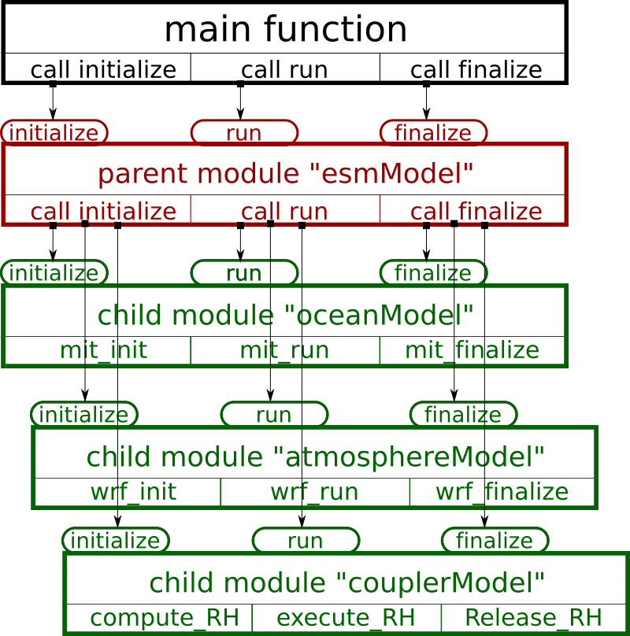

###############
Implementations
###############

The implementations of the coupler is based on the ATM--CPL--OCN example code:

https://sourceforge.net/p/esmfcontrib/svn/HEAD/tree/NUOPC/tags/ESMF_7_0_0/AtmOcnConProto/

The diagram of the coupled solver is: 

.. toctree::
   :maxdepth: 1
   :titlesonly:

   main function<main>
   parent module <mod_parent>
   child module: ocean <mod_ocn>
   child module: atmosphere <mod_atm>
   child module: coupler <mod_cpl>

