###########
Test MITgcm
###########

Test MITgcm using barotropic and baroclinic gyros
-------------------------------------------------

Compile the code
~~~~~~~~~~~~~~~~

Compile the barotropic tutorial cases without OpenMPI::

    cd $MITGCM_DIR/verification/tutorial_barotropic_gyre/build/
    ../../../tools/genmake2 "-mods" "../code" 
    make depend 
    make

Compile the baroclinic tutorial cases using OpenMPI::

    cd $MITGCM_DIR/verification/tutorial_baroclinic_gyre/build/
    cp ../code/SIZE.h ../code/SIZE.h_save
    cp ../code/SIZE.h_mpi ../code/SIZE.h
    ../../../tools/genmake2 "-mpi" "-mods" "../code" "-optfile" "/home/cpapadop/MITGCM_WRF/sio_build_options/ring_build_pgi_17.5-0_openmpi_2.1.1_netcdf.3.6.3"
    make depend 
    make

The *MITGCM_DIR* is the location of MITgcm source code. When compiling MITgcm,
the source code in *../code/* folder will be copied to the *./build/* folder. The
utility *genmakes* will generate the *Makefile* of MITgcm and utility *make*
will compile MITgcm.  If MITgcm is compiled successfully, the executable file
*mitgcmuv* can be seen in the build folders of both cases.

Run the code
~~~~~~~~~~~~

Before running the code, the input conditions/setup are required::

    # After the code is compiled in the "build" folder
    cd  ../run/
    ln -s ../input/* .
    ln -s ../build/mitgcmuv .

For the gyro_barotropic case, it is compiled without OpenMPI and should run in serial:: 

    ./mitgcmuv

For the gyro_baroclinic case, it is compiled using OpenMPI and should run in parallel::

    mpirun -np 4 mitgcmuv

Post-processing
~~~~~~~~~~~~~~~

First, add the path of the matlab post-processing code to the matlab path (in MATLAB)::

    addpath('$MITGCM_DIR/utils/matlab/')

Using the matlab code that MITgcm provided with us::

    U=rdmds('U');
    V=rdmds('V');
    XG=rdmds('XG');
    YG=rdmds('YG');
    contourf(XG,YG,U(:,:))
    contourf(XG,YG,V(:,:))
    quiver(XG(1:5:end,1:5:end),YG(1:5:end,1:5:end),U(1:5:end,1:5:end),V(1:5:end,1:5:end))

Then, we can obtain the contours of the flow velocity obtained in the gyro_barotropic case. The
setup of the barotropic gyro is:

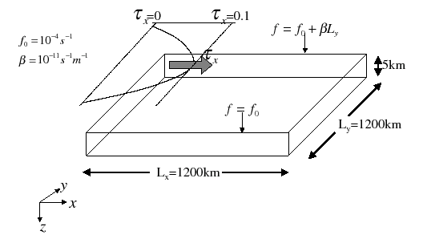

.. cannot use 90% as width, error would occur in latex
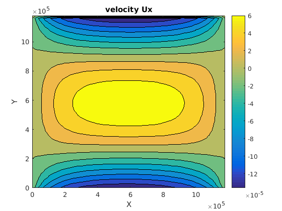
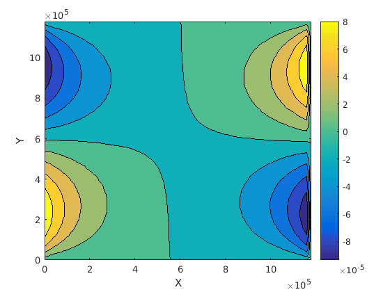
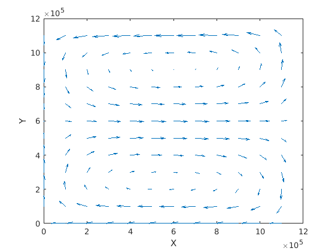

+-------------------------------+-------------------------------+
| Contour of flow velocity (Ux) + Contour of flow velocity (Uy) |
+-------------------------------+-------------------------------+
| |logo1|                       + |logo2|                       |
+-------------------------------+-------------------------------+
| Quiver plot of flow velocity  |                               |
+-------------------------------+-------------------------------+
| |logo3|                       |                               |
+-------------------------------+-------------------------------+

The setup of the baroclinic gyro is:

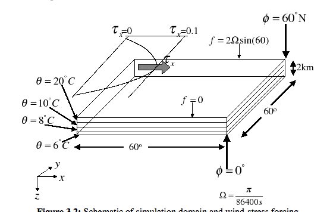

The quiver plot of the flow velocity are:

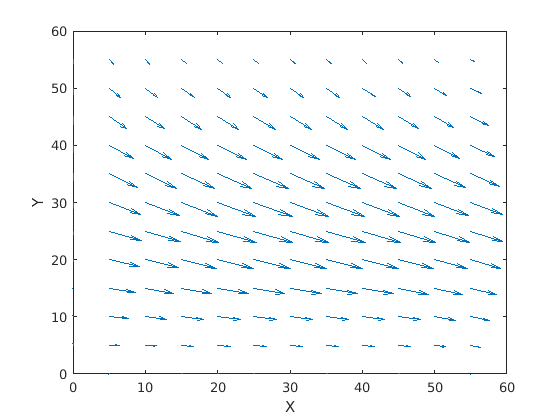
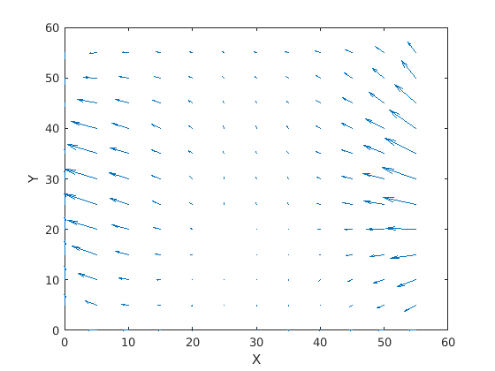
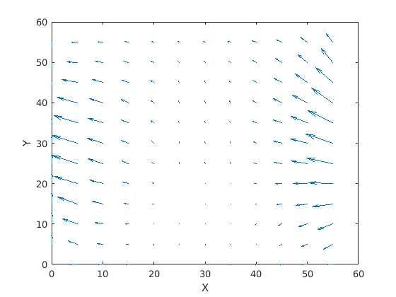

+-------------------------+-------------------------+
| Flow velocity at Z = Z0 + Flow velocity at Z = Z1 |
+-------------------------+-------------------------+
| |logo21|                + |logo22|                |
+-------------------------+-------------------------+
| Flow velocity at Z = Z0 + Flow velocity at Z = Z1 |
+-------------------------+-------------------------+
| |logo23|                + |logo24|                |
+-------------------------+-------------------------+

Python can also do the post-processing of the MITgcm results (need to install MITgcmutils in the
MITgcm code)::

    cd $MITGCM_DIR/utils/python/MITgcmutils/
    python setup.py install --user

To plot the MITgcm results using python::

    import MITgcmutils
    import matplotlib.pyplot as plt

    meshX = MITgcmutils.rdmds('$MITGCM_RESULTS_DIR/XC')
    meshY = MITgcmutils.rdmds('$MITGCM_RESULTS_DIR/YC')
    results = MITgcmutils.rdmds('$MITGCM_RESULTS_DIR/U')
    plt.contourf(mitgcm_meshX,mitgcm_meshY,results[0,:,:])

Test MITgcm using global case
-----------------------------

This is an MITgcm test case *global_ocean.cs32x15* of 4x4 global simulation
with seasonal forcing.  (The mesh resolution is Nx*Ny = 90x40 in both
directions.)

The input surface fluxes are from the monthly means of the NCEP climatology,
including the wind stress, heat flux, salinity flux, e.t.c.

Currently the results from the MITgcm solver and MITgcm—ESMF coupled solver are
identical because the coupled solver does not provide “new” information on the
input values.

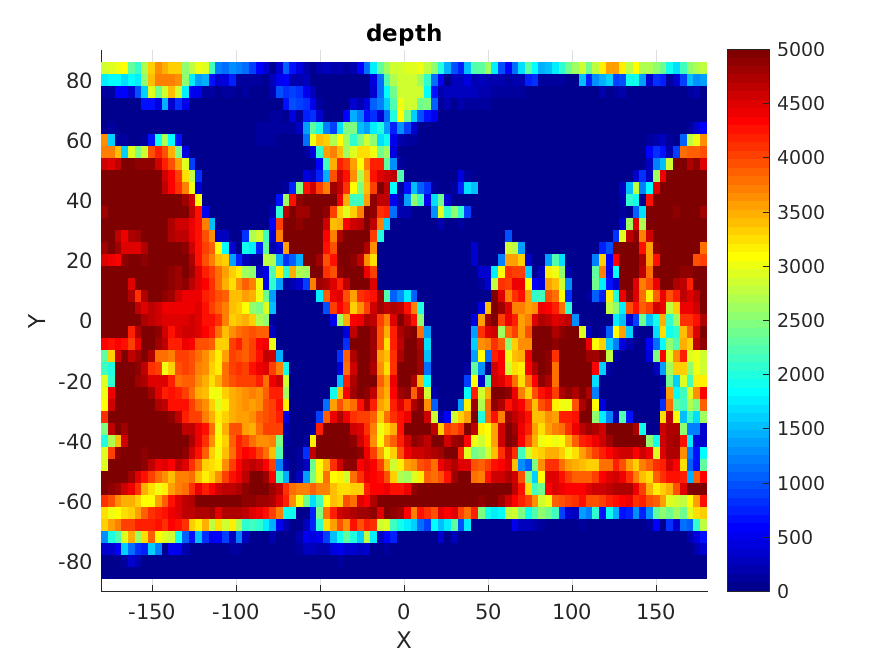
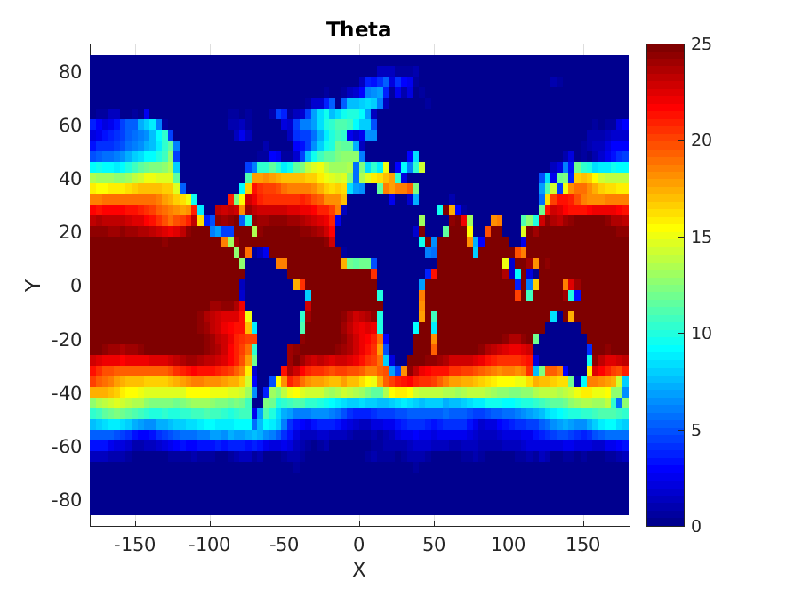
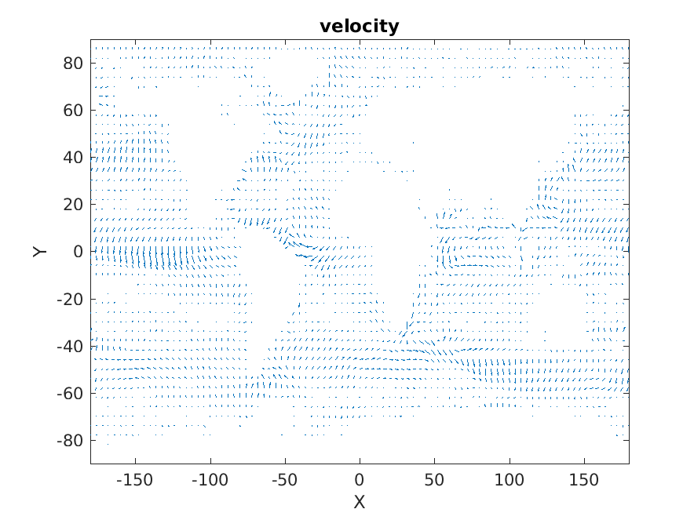

+------------------------------+------------------------------+  
| Depth of the ocean           + Sea Surface Temperature      |
+------------------------------+------------------------------+
| |logo31|                     + |logo32|                     |
+------------------------------+------------------------------+
| Current velocity quiver plot |                              |
+------------------------------+------------------------------+
| |logo33|                     |                              |
+------------------------------+------------------------------+
