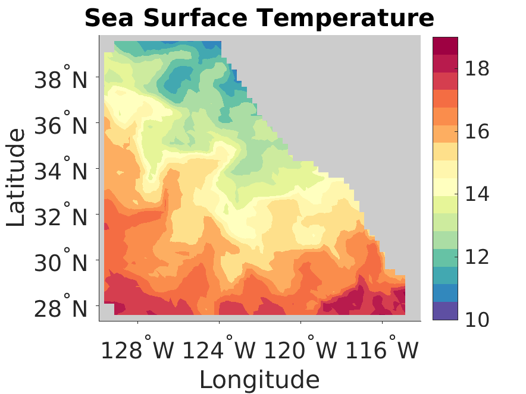
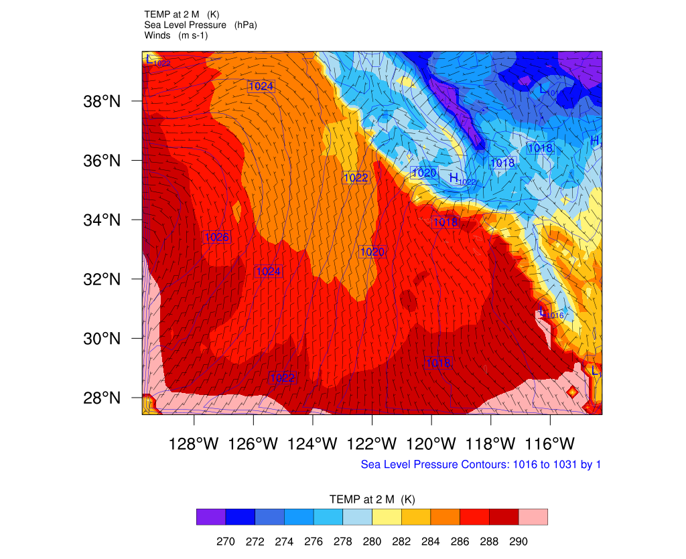

.. _tutorial_ca:

###################################################
Running the coupled simulation of California region
###################################################

Introduction
============

This is a tutorial of the simulation in the California region from Jan 01, 2018
to Jan 30, 2018. The ocean model MITgcm uses the heat fluxes, momentum fluxes
and fresh water fluxes from the atmosphere model WRF, and WRF uses the Sea
Surface Temperature as the input from MITgcm.

Run
===

To run the tutorial case, switch to *coupler/L3.C2.coupled_CA2018_ring*::
  
    ./install.sh

To run the case::

    ./install.sh
    cd runCase.init/
    ./Allrun
    cd runCase/
    ./Allrun

Post-processing
===============

Both MITgcm results and WRF results are generated by the coupled solver. There are several MATLAB or
NCL scripts to plot the data::

    # plot the MITgcm data (SST, SSH, Salinity, Current velocity, and Mixed Layer Depth)
    $PROJECT_DIR/coupler/script-post/test_california_ocean_loop.m 
    # compare the MITgcm data of two simulations
    $PROJECT_DIR/coupler/script-post/test_compare_california_ocean_loop.m 

    # plot the WRF data (Temperature, pressure, wind speed, PBL, precipitation)
    $PROJECT_DIR/coupler/script-post/wrf_real_plot.ncl
    # compare the WRF data of two simulations
    $PROJECT_DIR/coupler/script-post/wrf_compare_plot.ncl

+------------------------------+----------------------------------------+
| SST obtained by using MITgcm + Temperature at 2m obtained by using WRF|
+------------------------------+----------------------------------------+
| |logo1|                      + |logo2|                                |
+------------------------------+----------------------------------------+
