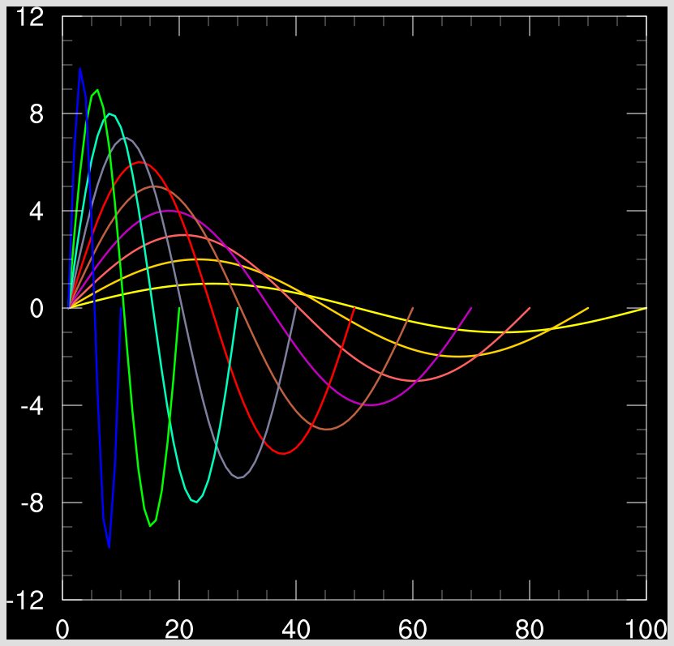

###############################
Install NCL for post-processing
###############################

Install Conda
=============

If you don't already have "conda" installed on your system, then go to:

    http://conda.pydata.org/miniconda.html

and select the appropriate "Python 2.7 64-bit bash installer" for your MacOSX or Linux system. Do
not download the Python 3.x version! (We do not have a Windows version.)

Follow the instructions for installing miniconda. When the installation is finished, you can test it
quickly by typing the following from a UNIX terminal window::

    conda -V

This should echo something like "conda 4.3.13".

Note: you can also use these conda instructions with an Anaconda distribution.

Install NCL using conda
=======================

We recommend that you install NCL under a conda "environment", which we'll call ncl_stable. You can
call it whatever you want.

From a UNIX terminal window in sh/bash mode, type::

    conda create -n ncl_stable -c conda-forge ncl=6.4.0
    source activate ncl_stable

You will need to run the "source activate ncl_stable" command every time you log out and log back in.

Test the NCL installation
=========================

From a UNIX terminal window, type::

    ncl -V
    ng4ex xy05n -clean -W png

The first command should echo "6.4.0".
The second command should produce the following "xy05n.png" PNG image:

The tutorial to install NCL using conda is also available at:

    http://www.ncl.ucar.edu/Download/conda.shtml
